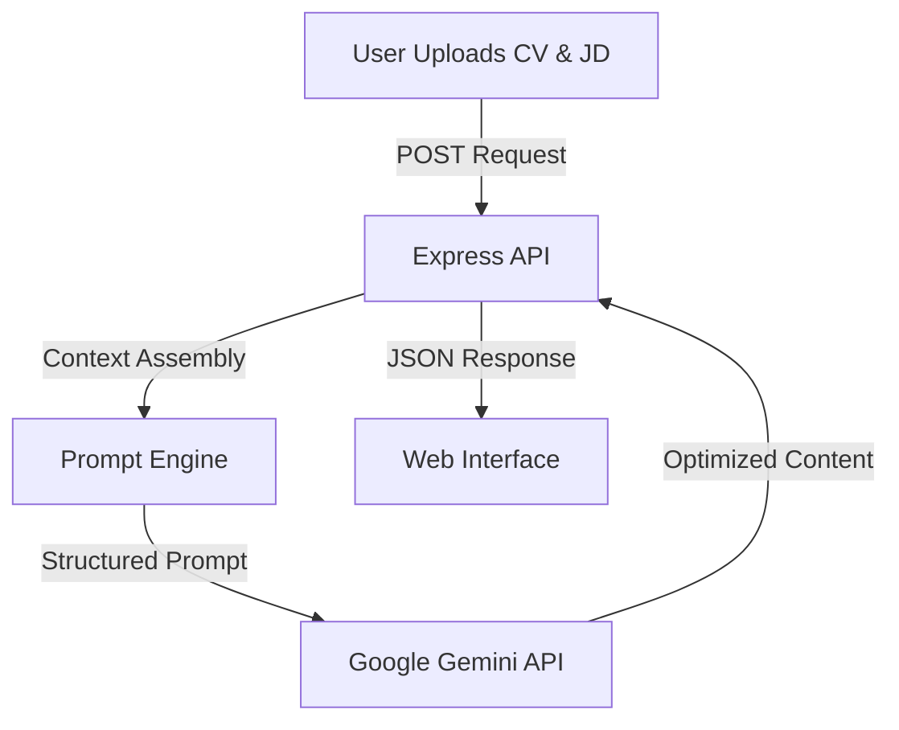

# Generative CV Tailor 🤖


> **A production-grade GenAI tool that autonomously rewrites resumes to match specific job descriptions using Google's Gemini API.**

This project moves beyond simple keywords. It utilizes **Large Language Models (LLMs)** to understand the semantic context of a candidate's experience and reframe it to align with the requirements of a target role, significantly increasing ATS (Applicant Tracking System) scores.

---

## 🧠 System Architecture

The core of the application is a prompt-engineering pipeline:



### Key Technical Highlights
*   **LLM Integration:** Direct integration with Google's Generative AI SDK (`@google/generative-ai`) for high-fidelity text generation.
*   **Prompt Engineering:** Custom-tuned system instructions to ensure the AI acts as a "Senior Technical Recruiter" (see `server.js`).
*   **Dynamic structured Output:** The AI parses unstructured resume text and returns structured, formatted JSON ready for rendering.

---

## 📂 Project Structure

*   `server.js`: The backend core. Handles file parsing (PDF/DOCX), context window management, and Gemini API calls.
*   `script.js`: Frontend logic for real-time streaming of AI responses.
*   `.env`: Secure management of API Keys (never hardcoded).

---

## 🚀 Getting Started

### Prerequisites
*   Node.js (v18+)
*   A Google Cloud Project with Gemini API access

### Installation

1.  **Clone the repository**
    ```bash
    git clone https://github.com/YourUsername/Generative-CV-Tailor.git
    cd Generative-CV-Tailor
    ```

2.  **Configuration**
    *   Create a `.env` file in the root directory:
        ```env
        API_KEY=your_google_gemini_api_key
        ```

3.  **Run the Server**
    ```bash
    npm install
    node server.js
    ```

4.  **Usage**
    *   Visit `http://localhost:3000`
    *   Paste your current CV text and the Job Description.
    *   Click "Tailor My CV" and watch the AI optimize your profile in real-time.

---

## 🛡️ AI Safety & Limits
*   **Rate Limiting:** Implements backoff strategies to handle API quotas.
*   **Data Privacy:** Resume data is processed in-memory and not stored persistently after the session ends.

---

## 🔮 Future Roadmap
*   [ ] PDF Generation: Auto-convert the JSON response into a downloadable PDF.
*   [ ] Multi-Model Support: Toggle between GPT-4 and Gemini Pro.
